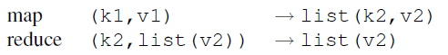
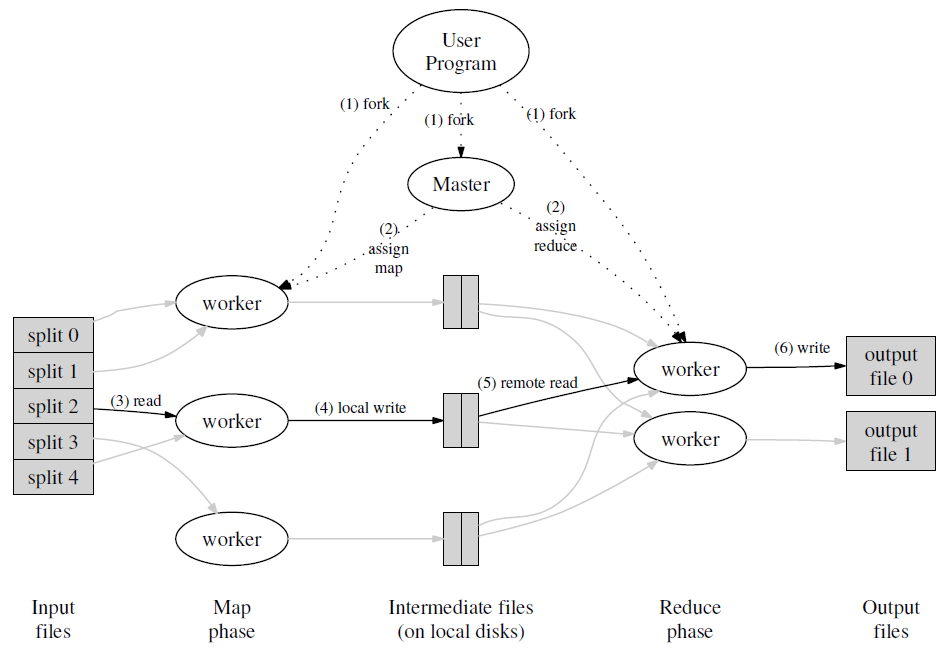
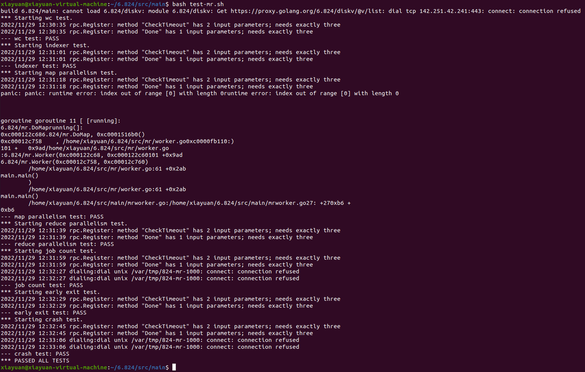

# MIT 6.824 Lab1实验记录
# 前言
MapReduce是著名的面向大规模数据处理的并行计算模型和方法，本实验考虑实现MapReduce，因此选取MIT 6.824 Lab1作为实验内容。本实验使用GO编程语言，为理解MapReduce的基本原理和主要涉及方法，需要阅读论文MapReduce: Simplified Data Processing on Large Clusters（CACM’08），接下来，本文将依次阐述MapReduce论文的思想、MapReduce实现的主要模块、实验环境与测试，最后做出总结。
# 论文理解
该论文提出了一种针对大数据处理的编程模型MapReduce及其实现，使得编程人员无需并行和分布式系统经验就可以轻松构建大数据处理应用。该模型将大数据处理问题拆解为两步，即 map 和 reduce，map 阶段将一组输入的键值对转化为中间结果键值对，reduce 阶段对中间结果键值对按照相同的键进行值的合并，从而得到最终的结果。
## MapReduce编程模型
许多问题都可以转化成MapReduce的计算形式：计算读取一组输入键值对，并生成一组输出键值对。由用户编写的Map读取输入键值对(k1,v1)，并生成一组中间键值对(k2,v2)，传递给Reduce函数。Reduce也由用户编写，接受中间键和该键的一组值，形成一组更小的值。

## MapReduce实现
论文提到过，MapReduce的不同实现取决于不同环境。论文的MapReduce实现方法适用于通过以太网连接的大型商用PC集群，并针对不可预测的网络及机器故障提供了容错、任务粒度、中间键值对排序、备份任务等优化方法。本实验借鉴论文的实现方法，在单机模拟分布式的环境下实现了简单版的MapReduce。
下图展示了MapReduce调用的整体流程，主节点Master负责管理和调度所有任务。首先，Master将所有输入划分为M块，由M个工作节点并行处理，产生的中间键值对通过分区函数（例如hash(key) mod R）将中间键值对分区成R块，交由R个工作节点并行处理，最后生成R个输出文件。

# MIT 6.824 lab1实现
## 任务要求
首先阅读Lab1的规则和描述，任务要求实现一个分布式的 MapReduce，由两个程序组成，Coordinator和Worker。测试只有一个Coordinator进程和一个或多个并行执行的Worker进程，这些进程都在一台机器上运行。Worker将通过RPC与Coordinator交谈。每个Worker进程都会向Coordinator请求一项任务，从一个或多个文件中读取任务的输入，执行任务，并将任务的输出写入一个或多个文件。Coordinator应该注意到Worker是否没有在合理的时间内完成任务（对于本实验，设置为10秒），如果超时则分配该任务给另一个Worker。

通过阅读规则与提示，大概有个模糊的实现思路。本文将实现划分为了几个主要的模块，分别是重要数据结构定义、Worker的工作流程、Coordinator如何响应请求以及如何进行任务管理，下面依次给出实现方法。
## 重要数据结构定义
首先关注coordinator和worker的rpc交互流程，worker.go中的call函数传入args和reply的内存地址，申请调用rpcname（即Coordinator.函数）。Coordinator在建立时就调用server()方法监听来自Worker的请求，Coordinator收到请求后运行指定方法，读取入参写回结果。

rpc.go中给出了ExampleReply是Worker向Coordinator的请求数据，MapReduce中Worker要向Coordinator请求任务，所以首先定义Coordinator发送给Worker的任务的结构体：
```go
//中间文件命名 mr-X-Y X是map任务号，y是reduce任务号
type Job struct{
        JobType JobType    //任务类型，Map or Reduce
        InputFile []string      //文件名
        JobId int    //X
        ReducerNum int    //reduce任务总数
```
由于所有文件都存放在本地磁盘上，所以需要对中间结果文件进行命名区分，中间文件的命名规则是"mr-tmp-x-y"，x是jobid，y是经过hash后的reduce id。这样，对于每一个map任务产生的一组中间键值对，通过hash(key) mod R的方法，分成R份，产生R个中间文件（mr-tmp-x-y，y>=0，y<R）。Map阶段一共生成M*R个中间文件。

主节点需要定义数据结构来维护任务状态。Coordinator需要管理所有处于不同状态的任务，由于同时可能由多个Worker线程请求任务，因此直接将任务Job存放在队列channel中，保证同步并发。Coordinator定义了两个channel来存放待执行的map和reduce任务，CoordinatorCondition表示当前整个工作的所处阶段。
```go
type Coordinator struct {
        // Your definitions here.
        JobChannelMap        chan *Job    //消息队列存放map任务
        JobChannelReduce     chan *Job     
        ReducerNum           int          //总共reduce的数目
        MapNum               int          //总共map的数目
        CoordinatorCondition Condition    //mapreduce所处阶段，map/reduce/alldone
        uniqueJobId          int              //用于元数据管理
        jobMetaHolder        JobMetaHolder       //元数据管理
}
```
Coordinator无需记录每个Worker的工作状态，但要记录每个任务的执行状态，判断任务是否超时，或决定是否进入下一阶段。不同于天然并发支持的channel，每次访问JobMetaHolder需要加锁。
```go
//所有任务的元数据管理
type JobMetaHolder struct {
        MetaMap map[int]*JobMetaInfo   //每一个jobid有唯一的元数据
}
type JobMetaInfo struct {
        condition JobCondition      //waiting/working/done  
        StartTime time.Time     //开始执行时间
        JobPtr    *Job
}
```
## Worker的工作流程
每一个空闲的工作节点主动向主节点发送任务请求，根据返回的任务类型，工作节点执行不同方法：
1. Map类型，工作节点执行Map方法，执行完成后，反馈给Coordinator，Coordinator调用相关方法修改任务元数据信息
2. Reduce类型，与应对Map类型相似
3. WaittingJob类型，说明当前所有任务都已分配，没有空闲任务，所以工作节点进入等待状态，过一段时间继续请求任务
4. KillJob类型，主节点判定整个MapReduce工作全部完成，工作节点也结束工作
```go
// main/mrworker.go calls this function.
func Worker(mapf func(string, string) []KeyValue, reducef func(string, []string) string) {
    alive := true
    attempt := 0
    for alive {
        attempt++
        job := RequireTask()  //请求任务，调用Coordinator.DistributeJob
        switch job.JobType {
        case MapJob:
            {
                DoMap(mapf, job)
                JobIsDone(job)  //反馈任务完成，调用Coordinator.JobIsDone
            }
        case ReduceJob:
            if job.JobId >= 8 {
                DoReduce(reducef, job)
                JobIsDone(job)
            }

        case WaittingJob:   //暂时没有空闲任务，但MapReduce工作还未完成
            time.Sleep(time.Second)
        case KillJob:    //全部工作已完成
            {
                time.Sleep(time.Second)
                alive = false   //退出循环
            }
        }
        time.Sleep(time.Second)    //理解：休眠一会可以模拟网络延迟
    }
}
```
- Map和Reduce实现

Worker调用DoMap方法完成Map任务，生成中间键值对intermediate，使用给定的函数ihash(Key)%rn将中间键值对分成rn份，分别写进中间文件。可见，一共生成了rn个中间文件。
```go
//根据返回的Job执行Map任务，mapf是wc.go中的函数
func DoMap(mapf func(string, string) []KeyValue, response *Job) {
    var intermediate []KeyValue
    filename := response.InputFile[0]
    file, err := os.Open(filename)
    if err != nil {
        log.Fatalf("cannot open %v", filename)
    }
    content, err := ioutil.ReadAll(file)  //读取输入kv对
    if err != nil {
        log.Fatalf("cannot read %v", filename)
    }
    file.Close()
    intermediate = mapf(filename, string(content))
    //initialize and loop over []KeyValue
    rn := response.ReducerNum   //需要将结果分成rn份
    HashedKV := make([][]KeyValue, rn)   //建立切片，大小为nr，每个元素的类型是[]keyvalue

    for _, kv := range intermediate {   //使用hash(key)%rn切分
        HashedKV[ihash(kv.Key)%rn] = append(HashedKV[ihash(kv.Key)%rn], kv)
    }
    for i := 0; i < rn; i++ {   //写到当前目录下 mr-tmp-jobid-i
        oname := "mr-tmp-" + strconv.Itoa(response.JobId) + "-" + strconv.Itoa(i)
        ofile, _ := os.Create(oname)
        enc := json.NewEncoder(ofile)
        for _, kv := range HashedKV[i] {
            enc.Encode(kv)
        }
        ofile.Close()
    }

}
```
Worker调用DoReduce方法完成Reduce任务，该任务的输入是R个中间文件表示的中间键值对，已包含在Job结构体中。DoReduce获取全部键值对后，首先依照Key值排序，这样在Reduce时，相同key值的value可以迅速合并，从而加速Reduce的速度。
```go
func DoReduce(reducef func(string, []string) string, response *Job) {
    reduceFileNum := response.JobId
    intermediate := readFromLocalFile(response.InputFile)  //从R个中间文件读取全部kv对
    sort.Sort(ByKey(intermediate))   //按照Key排序
    dir, _ := os.Getwd()
    tempFile, err := ioutil.TempFile(dir, "mr-tmp-*")    //临时文件
    if err != nil {
        log.Fatal("Failed to create temp file", err)
    }
    i := 0
    for i < len(intermediate) {
        j := i + 1
        for j < len(intermediate) && intermediate[j].Key == intermediate[i].Key {
            j++   //相同key值的跳过
        }
        values := []string{}
        for k := i; k < j; k++ {
            values = append(values, intermediate[k].Value)
        }
        output := reducef(intermediate[i].Key, values)  //该key对应的全部value
        fmt.Fprintf(tempFile, "%v %v\n", intermediate[i].Key, output)
        i = j
    }
    tempFile.Close()
    oname := fmt.Sprintf("mr-out-%d", reduceFileNum)
    os.Rename(tempFile.Name(), oname)   //以防崩溃，重命名的方式实现原子写文件
}
```
## Coordinator响应请求
每当收到Worker的任务请求，Coordinator调用DistributeJob方法进行处理。根据当前所处阶段，Coordinator从任务队列中取出map或reduce任务发给Worker，如果当前没有空闲任务而全部工作还未执行完，则让Worker陷入等待。
```go
//响应worker的任务请求，分发任务
func (c *Coordinator) DistributeJob(reply *Job) error {
    mu.Lock()
    defer mu.Unlock()
    if c.CoordinatorCondition == MapPhase {  //当前处于map阶段
        if len(c.JobChannelMap) > 0 {
            *reply = *<-c.JobChannelMap
            if !c.jobMetaHolder.fireTheJob(reply.JobId) {   //backup tasks
                fmt.Printf("[duplicated job id]job %d is running\n", reply.JobId)
            }
            go c.Check
        } else {
            reply.JobType = WaittingJob   //当前没有空闲任务
            if c.jobMetaHolder.checkJobDone() {     //检查该阶段是否已结束
                c.nextPhase()
            }
            return nil
        }
    } else if c.CoordinatorCondition == ReducePhase {   //reduce阶段
        if len(c.JobChannelReduce) > 0 {
            *reply = *<-c.JobChannelReduce
            if !c.jobMetaHolder.fireTheJob(reply.JobId) {
                fmt.Printf("job %d is running\n", reply.JobId)
            }
        } else {
            reply.JobType = WaittingJob
            if c.jobMetaHolder.checkJobDone() {
                c.nextPhase()    //进入下一阶段
            }
            return nil
        }
    } else {
        reply.JobType = KillJob    //全部工作都已完成
    }
    return nil

}
```
为了防止worker执行任务超时使得整个工作陷入停滞，借鉴论文中的"Backup Tasks"的思想，当某一任务超时，则分配另一个worker，并行地执行该任务。本实现中，每当分配一个任务，则开启一个线程监督该任务，如果超时仍未完成，则将该任务再次放入任务队列中，等待空闲worker请求。检验是否超时的方法Coordinator.CheckTimeout定义如下：
```go
//每次分发任务给worker后启用另一个线程检查任务是否超时
func (c *Coordinator) CheckTimeout(jobId int){
        time.Sleep(time.Second * time.Duration(10))
        mu.Lock()
        if c.CoordinatorCondition == AllDone {
                mu.Unlock()
                return
        }
        defer mu.Unlock()
        ok, jobInfo := c.jobMetaHolder.getJobMetaInfo(jobId)
        if !ok {  //该任务必须存在 且 处于等待开始 状态
                return
        }
        if jobInfo.condition == JobWorking{
                switch jobInfo.JobPtr.JobType {
                case MapJob:
                        c.JobChannelMap <- jobInfo.JobPtr   //重新写入任务队列
                        jobInfo.condition = JobWaiting   //重新置为等待状态
                case ReduceJob:
                        c.JobChannelReduce <- jobInfo.JobPtr
                        jobInfo.condition = JobWaiting

                }
        }
        
}
```
Worker完成任务后，发送消息给Coordinator，调用JobIsDone方法，修改元数据状态，标记任务状态已完成。
```go
//响应worker的任务完成反馈
func (c *Coordinator) JobIsDone(args *Job, reply *ExampleReply) error {
    mu.Lock()
    defer mu.Unlock()
    switch args.JobType {
    case MapJob:
        ok, meta := c.jobMetaHolder.getJobMetaInfo(args.JobId)
        if ok && meta.condition == JobWorking {    //任务已完成
            meta.condition = JobDone   //修改元数据状态
        }
        break
    case ReduceJob:
        ok, meta := c.jobMetaHolder.getJobMetaInfo(args.JobId)
        if ok && meta.condition == JobWorking {
            meta.condition = JobDone
        }
        break
    default:
        panic("wrong job done")
    }
    return nil
}
```
## 任务管理
- map与reduce任务制作
程序运行开始，Coordinator根据输入文件制作map任务，放入map任务队列，初始化元数据信息，等待Worker请求。
```go
//主节点制作任务
func (c *Coordinator) makeMapJobs(files []string) {
        for _, v := range files {
                id := c.generateJobId()   //每一任务由唯一编号id
                job := Job{
                        JobType:    MapJob,
                        InputFile:  []string{v},  //这里没有分片
                        JobId:      id,
                        ReducerNum: c.ReducerNum,
                }
                jobMetaInfo := JobMetaInfo{   //置为等待状态
                        condition: JobWaiting,
                        JobPtr:    &job,
                }
                c.jobMetaHolder.putJob(&jobMetaInfo)   //元数据管理
                c.JobChannelMap <- &job      //写入消息队列
        }
}
```
当所有map任务队列为空，Coordinator进入reduce阶段，开始制作reduce任务，每一个Reduce任务对应M个中间文件作为其输入文件。
```go
func (c *Coordinator) makeReduceJobs() {
        for i := 0; i < c.ReducerNum; i++ {
                id := c.generateJobId()  //每一任务由唯一编号id
                job := Job{
                        JobType:   ReduceJob,
                        JobId:     id,
                        //分配文件：mr-tmp-x-i，其中0=<x<M
                        InputFile: TmpFileAssignHelper(i, "main/mr-tmp"),   
                }
                jobMetaInfo := JobMetaInfo{
                        condition: JobWaiting,
                        JobPtr:    &job,
                }
                c.jobMetaHolder.putJob(&jobMetaInfo)
                c.JobChannelReduce <- &job

        }
}
```
- 状态转变
在上述的分发任务方法DistributeJob中，当任务队列为空，则调用checkJobDone方法检测当前阶段是否已结束。若当前处于Map阶段，checkJobDone返回true，Coordinator进入Reduce阶段；若当前处于Reduce阶段，checkJobDone返回true，Coordinator宣布所有工作已完成。
```go
func (j *JobMetaHolder) checkJobDone() bool {
    reduceDoneNum := 0
    reduceUndoneNum := 0
    mapDoneNum := 0
    mapUndoneNum := 0
    for _, v := range j.MetaMap {
        if v.JobPtr.JobType == MapJob {
            if v.condition == JobDone {
                mapDoneNum += 1
            } else {
                mapUndoneNum++
            }
        } else {
            if v.condition == JobDone {
                reduceDoneNum++
            } else {
                reduceUndoneNum++
            }
        }
    }
    if (reduceDoneNum > 0 && reduceUndoneNum == 0) || (mapDoneNum > 0 && mapUndoneNum == 0) {
        return true
    }

    return false
}
```
# 实验结果
## 运行环境
实验在ubuntu虚拟机上运行，各版本参数如下：
| 配置 | 版本 |
| ----- | ----- |
| 操作系统 | Ubuntu 20.04 |
| gcc | gcc version 9.4.0 |
| go version | go1.13.8 linux/amd64 | 
## 测试结果
测试结果如下图所示，所有案例全部通过。由于实验设置，一些来自GO RPC的报错可以暂时忽略，这些报错将在Lab2解决。实现的超时的处理有问题，经常不能通过crash_test测试。

# 总结
本次实验我真正动手实现了MapReduce编程模型，代码层次上理解并实现了主节点如何管理和分发任务并处理超时工作节点，从而加深了我对并行编程概念和MapReduce设计思想的理解。我也学会了一点Go语言的语法，Go语言对并行编程很友好，提供的Channel支持数据共享和同步。然而，毕竟主节点和工作节点都在一台机器上运行，彼此之间不需要传输大量数据，所以不用考虑复杂的网络通信以及对海量数据作切片和迭代处理，这些是在实现真正的分布式系统中需要考虑的。